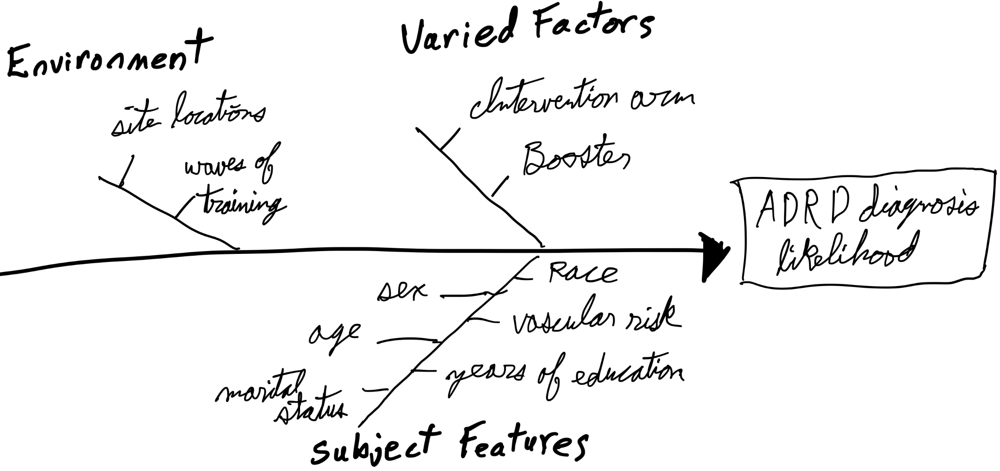

#+Title: STAT 512 - Methods of Data Analysis Project: Part 1
#+Author: Ben Heinze
#+OPTIONS:  toc:nil
# This is used to shrink the pdf page margins
#+LATEX_HEADER: \usepackage[left=0.75in,right=0.75in,top=1in,bottom=1in]{geometry}

# This is used to shrink the spacing between bullet points
#+LATEX_HEADER: \usepackage{enumitem}
#+LATEX_HEADER: \setlist[itemize]{itemsep=2pt, topsep=4pt}

* Background

Alzheimers disease and related dementias (ADRD) is an increasingly common issue as the neurological decline persists heavily in older adults.
This set of diseases can take years to progress, which makes it difficult to conduct a long-term study.
This paper, "Impact of cognitive training on claims-based diagnosed dementia over 20 years: evidence from the ACTIVE study" by Coe et. al. aimed to address this issue by linking previous data from the Advanced Cognitive Training for Independent and Vital Eldery (ACTIVE) dataset with Medicare claims data to create a 20-year follow up period to analyze.
The researcher's goal was to attempt to find a correlation with cognitive training and a lower ADRD diagnosis rate in suspectible patients.
The researchers randomized the participants into four cognitive interventions after baseline data was measured: memory-based, speed-based, reasoning-based, and a control group.
If the subject completed eight of the 10 training sessions, the subjects were randomized once more for a potential secondary "booster" sessions that took place 11 and 35 months after baseline.

* Description of Study Design

#+CAPTION: Conceptual diagram of factors that may effect the likelihood of an ADRD diagnosis
#+ATTR_LATEX: :width 0.7\linewidth :center t

In an attempt to determine whether cognitive training intervention effects the likelihood of an ADRD diagnosis, these researchers recruited eligible subjects from six metropolitan areas (Pennsilvania State University, Indiana University ,Hebrew Rehabilitation Center for the Aged, Johns Hopkins University, Wayne State University, and University of Alabama) between March 1998 and October 1999.
These participants were required to be 65+ years old, and pass a list of exclusion criterion. 5000 people were assessed in the study and 2802 of them were eligible. These eligible people's baseline was collected, then they were randomized into one of the four intervention arms: memory, speed, reasoning, and no intervention. Patients who completed eight out of 10 training sessions were eligible for the booster addition, and which group a patient was assigned to (booster, no booster) was randomized as well, with the exception of the controlled intervention group. An algorithm (Acumen's matching algorithm) was used to match SSNs, DOB, and gender from Medicare data to the initial ACTIVE dataset, in which 2021 (71%) of the 2802 ACTIVE subjects were matched.

This study had a control group where no intervention was used; this group also had no opportunity to recieve booster training sessions. This was a single-blind study where the staff who overlooked the cognitive training and questionnaires were not provided information on which group the subject was assigned to.

This list filtered out people with pre-existing significant cognitive dysfunction, functional impairment, self-reported diagnosis, people who experienced a stroke within the last 12 months, specific cancers, and people who were undergoing chemotherapy or radiation therapy.
This study randomized participants into one of the four intervention arms, plus randomized booster sessions for eligible participants. The experimental units are the 65+ year old people.The population of interest is the people who are prone to being diagnosed with an ADRD. The system of study is explained by how ADRD is set of neurological diseases that impact cognitive abilities in older adults. Since the diseases affect cognitive ability, researchers hypothesize that the progression of the disease may be combatted by increasing brain stimulation via cognitive training in hopes to offset the damage inflicted by the disease. The researchers measures this response by using a cause-specific Cox proportional hazard model that reports the chance of an ADRD diagnosis. I am not familiar with these methods and that is out of the scope of this class, so I will assume that these measurements are valid and reliable for statistical analysis, and I will refer to the response variable as the likelihood of being diagnosed with ADRD.

For the varied factors, the intervention arm treatment and the booster are varied across the participants.
The paper states that they held the six site locations and the waves of the training and testing.
Confounding variables to be controlled by analysis (covariates) are the pre-specified patient characteristics described in the diagram above: age, sex, race, marital status, years of education, and vascular risk (vascular risk is associated with a higher likelihood of ADRD diagnosis). Every eligible subject was properly randomized to control confounding variables within the types of people and the type of intervention.

The outline of statistical analysis has sites (six levels), patients have the type of intervention arm (four levels), then the booster sessions (two levels). The interaction between the intervention arm and the booster sessions will be included.

* Research Question

The research question for this academic paper wonders if intervention via cognitive training effects the likelihood of being diagnosed with ADRD over a 20-year follow-up time frame.
The authors of this paper conducted this research with a modified cause-specific Cox proportional hazard model which reported the odds of being diagnosed with ADRD. They also reported the Fine-Gray hazard models. Once again, I am not familiar with these methods so I will refer to the response variable as the likelihood of being diagnosed with ADRD, and will assume that the model's outputs are reliable.

In the theorical model, I would use the likelihood of being diagnosed with ADRD as my response.
The explanatory variables would be the intervetion arm, and the booster.
Other factors such as age and number of years of education may be added.
Performing a step-wise variable selection may benefit our model. This research paper explicitely says that they hold the site locations and the waves of training fixed for this linear mixed model. 
From my understanding, to use a mixed model to help generalize their findings to a larger population, it would require using the six site locations as a random effect, not a fixed effect.
I am curious for their reasoning behind this decision. Besides this descrepency, the authors methods make sense. They have a very large sample group that was randomly assigned to intervention. If the patients performed the training for long enough, they were allowed to be assigned booster sessions, which was also randomized. Instead of actively following up with the patients, they used the past ACTIVE study and synced it to Medicare data to increase the length of this study. It is worth noting that not everybody has Medicare, this will effect the scope of inference. Despite this trials best intentions, the 76% of the participants wwere female, and 71% were white. This data is unbalanced towards female participants and white participants, and the study adjusted this as a covariate.

* Proposed theoretical model, EDA plan, and description of analysis plan

This model keeps the sites fixed, so we will use an LMM for the mixed model:

\begin{equation}
y_{ij} = \mu_{ij} + EU_i + \epsilon_{ij}
\end{equation}

The mean is the likelihood of being diagnosed with ADRD given the intervention arm, booster, checkup, and site:

\begin{align}
\mu_{ij} \{ \text{ADRD} \mid \text{arm, booster, checkup, site} \} = \text{arm} \times \text{booster} \times \text{checkup} \times \text{site}
\end{align}

Where the indicators are defined as:
- Arm has four factors: memory, speed, reasoning, control. The indicator will be 1 if the patient belongs to the corresponding factor, and 0 otherwise.
- Booster has two factors: yes and no. The indicator will be 1 if the patient belongs to the corresponding factor, and 0 otherwise.
- Checkup has three factors: Baseline checkup, 10-year checkup, 20-year checkup. The indicator will be 1 if the patient belongs to the corresponding factor, and 0 otherwise. It the paper was unclear with how many times each patient got tested. It is reasonable to assume patients with booster trainings recieved more checkups. Due do the vagueness in the paper, I am assuming there these three factors exist and were recorded: The initial baseline checkup, the 10-year checkup that followed from the original ACTIVE data research paper, then the 20-year checkup that was created through syncing the ACTIVE data with the Medicare data. 
- Arm has six factors: Pennsylvania State University, Indiana University, Hebrew Rehabilitation Center for the Aged, Johns Hopkins University, Wayne State University, and University of Alabama. The indicator will be 1 if the patient belongs to the corresponding factor, and 0 otherwise.

The random effects and error terms are distributed as:

\begin{equation}
EU_{i} \sim \mathcal{N}(0, \sigma^2_{EU}), \qquad \epsilon_{ij} \sim \mathcal{N}(0, \sigma^2)
\end{equation}

Where $i = 1, 2, \ldots, 6$ for the six site locations, and $j = 1, 2, \ldots, 8$ is the combination of arm and boosters.

The outline for the raw data visualizations goes as follows:
- Plot a raw visualization of the likelihood of being diagnosed with ADRD as the Y-axis, and the X axis is the factor category of checkup. Plot the data color coded with the diferent combinations of intervention arm and booster. This will show us if this data is better represented as a parallel-lines model or an interaction model
- This visualization will also illustrate how the likelihoods of each category updates over the course of discrete time.

The tentative steps to address the research question goes as follow: 
- Use a formal interaction test to assess whether there is evidence of an interaction between the explanatory variables. A type 2 sums of squares test will also accomplish this. The sample sizes for each group is roughly the same, however the booster samples are subidivisions of the intervention arm's sample which makes the sample sizes between intervention arms and booster sessions unbalanced.
- Use an effects plot to spot differences between the intervention techniques.
- Perform a comparison of group means or an all pairwise comparison based on whether the model is an interactive model or an additive model.
    

* Scope of Inference

The sample was selected via recruiting. This study can be generalized to people aged 65+ from people recruited between March 1998 and October 1999 with Medicare who reside in one of the six metropolitan areas (Pennsylvania State University, Indiana University, Hebrew Rehabilitation Center for the Aged, Johns Hopkins University, Wayne State University, and University of Alabama) who do not have any of the following concerns: significant cognitive dysfunction (MMSE score < 23), functional impairment, self-reported diagnosis of Alzheimers, a stroke within the last 12 months, certain cancers, and those who are undergoing chemotherapy/radiation therapy.

Since this study conducted a random assignment for the intervention arm and the booster sessions, this study accounted for the confounding variables which provides strong evidence that there is a causal relationship between cognitive intervention arm and reduced likelihood of being diagnosed with ADRD.
