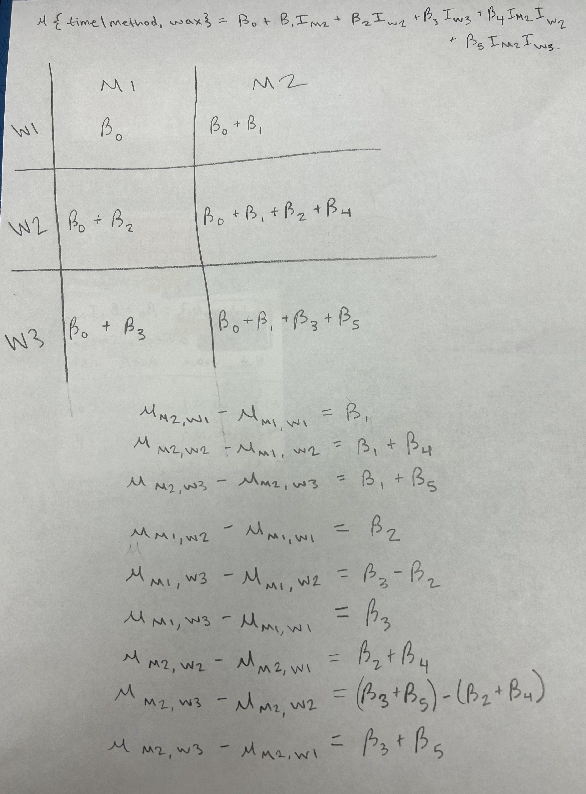
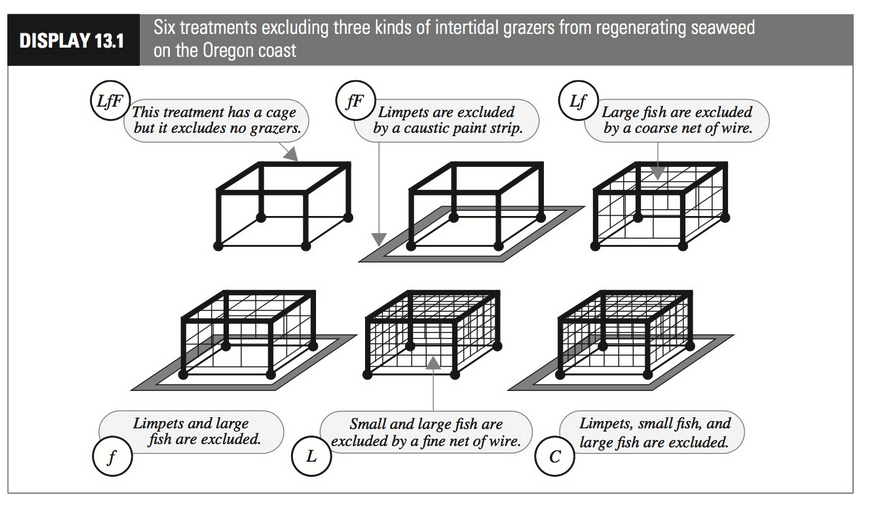
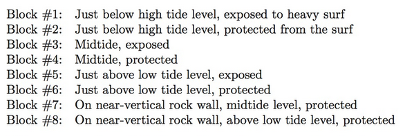

```{r setup, include=FALSE}
knitr::opts_chunk$set(echo = TRUE)
```

## Part I:

1.  (10 pts) Include your handwritten "cell means" two-way table describing the means for all combinations of wax and method as functions of regression parameters ($\beta$s) for the interactive model. Use an approach similar to the approach we used for the additive model to demonstrate how cells of the table are related in the the non-additive model.


{width="3.5in"}

## Part II: Intertidal Seaweed Grazers (Case Study)

**Big-picture motivation:** Interest was in investigating how the presence of 3 different ocean grazers (limpets: present (L) or not (~~L~~), small fishes: (f, ~~f~~) and large fishes: (F, ~~F~~)) affects regeneration rates of seaweed in 8 different intertidal zones (`B1:B8`). Specifically,

-   Which grazer consumes the most seaweed
-   Do different grazers influence impacts of the other grazers?
-   Are grazing effects similar in all microhabitats (intertidal zones)?

Researchers prepared 12 plots within each intertidal zone by scraping all seaweed off of the plot and installing a randomly assigned treatment condition. Each of the 6 treatment combinations were randomly assigned to 2 sites within each block, *making this a randomized complete block design (RCBD) with 2 replications.*

-   `Cover`: count (out of 100 holes) showing seaweed regeneration at the end of the study period
-   `Block`: tidal condition (`B1`, `B2`,...,`B8`, see text for descriptions)
-   `Treat`: combination of grazers allowed to access the plot (`LfF`, `fF`, `Lf`, `f`, `L`, `C`)
-   Within each `Block` there were 12 plots available. Each of the 6 treatment combinations were randomly

{width="3.5in"} {width="3.5in"}

1. (5 pts) Explain why a non-additive model allows us to address the question of *"Are grazing effects similar in all microhabitats (intertidal zones)?"*


**A non-additve model allows us to address the question "Are grazing effects similar in all microhabitats (intertidal zones)?" because the model accounts for potential interactions between the treatments and blocks.**

The code chunk below will load packages we will use and create an object named `df_grazers` that contains the data from the case study.

```{r load-data, message=FALSE, echo = FALSE, eval = TRUE}
library(tidyverse)
library(Sleuth3)
library(ggplot2)
data(case1301)
df_grazers <- case1301
```

2.  (5 pts) Fit the non-additive model and create the standard suite of diagnostic plots. Reference appropriate plots to assess the *constant variance* assumption and *make at least one connection between the patterns you observe in the two plots you can use to make your assessment*.

```{r q2-tentative-fit}
fit_int <- lm(Cover ~ Treat * Block, data=df_grazers)
summary(fit_int)

round(summary(fit_int)$coeff, 4)
par(mfrow = c(2,2))
plot(fit_int, pch = 18)

```

**We have strong evidence against constant variation because the Residuals vs Fitted plot shows a fanning-out of the datapoints. When we observe the scale-location plot, we can also see a fanning pattern that is similar to the residuals vs fitted plot, bu over a parabolic curve instead of a straight line.**

When bounded counts like the variable `Cover` (which are integer values bounded below by 0 and above by 100) are naively modeled as $Normal$ RVs with MLR, they exhibit a particular type of non-constant variance that requires a specific transformation. *Note: Later this semester we will learn how to model counts like this with a logistic regression model (a type of generalized linear model (GLM)).* We'll use a *logit (log odds) transformation:* $\displaystyle logit(Cover) = log(\frac{Cover}{100-Cover})$

3.  (5 pts) Do we ever observe a cover of 0 (no regeneration) or 100 (complete regeneration) in these data? What mathematical problems would arise with the *logit transformation* if we did observe either of these two extreme counts?

**No, cover cannot have a value of 0 or 100. log(0) is undefined, and if you had a cover of 100 then you would have a divide-by-zero error.**

4.  (5 pts) Create a variable for logit-regeneration within the `df_grazers` data frame.

```{r q4-transformation, fig.width = 10, fig.height=4, out.width="0.8\\linewidth"}
df_grazers_logit <- df_grazers |>
  mutate(CoverLogit = log(Cover/(100-Cover)))
```

5.  (5 pts) Make a plot of logit(cover) vs. cover and describe what the logit transformation does to the counts.

```{r q5-transformation, fig.width = 10, fig.height=4, out.width="0.8\\linewidth"}
df_grazers_logit |> ggplot(aes(x= CoverLogit, y= Cover)) +geom_point()
```

**The logit transformation changes the count so that it is a continues variable that is centered at zero.**

6.  (5 pts) Refit the non-additive model with logit-count as your new response and create the standard suite of diagnostic plots, do you have any concerns with modeling assumptions that can be assessed from these plots? Briefly explain.

```{r q6-non-add-fit}
fit_int_logit <- lm(CoverLogit ~ Treat * Block, data=df_grazers_logit)
summary(fit_int_logit)

round(summary(fit_int_logit)$coeff, 4)
par(mfrow = c(2,2))
plot(fit_int_logit, pch = 18)
```

**The fanning in the residuals vs fitted plot can be concerning since that is still evidence against constant variance.**

7.  (5 pts) Use the package `yarrr` to quickly create a raw-data plot of logit-seaweed generation as a function of block and treatment. Describe what you see.

```{r q7-data-viz, eval = TRUE}
# install yarrr if needed
# install.packages(remotes)
# remotes::install_github("ndphillips/yarrr", build_vignettes = TRUE)
# load yarrr 
library(yarrr)

# replace @@@@ with the variable you created for logit(Cover) 
pirateplot(CoverLogit ~ Block + Treat, data = df_grazers_logit)
```

**The treatments with the large fish have the lowest logit cover values, leading us to believe that large fish may have a big impact on seaweed cover and could be the biggest consumers of seaweed. The two lowest groups also have combinations of 2-3 grazers, which makes sense given that more types of species present would result in more seaweed being eaten.**

8.  (5 points) Create an interaction plot using `intplot` in `catstats`. Does there appear to be an interaction between treatment and block as they relate to logit regeneration ratio? Justify your answer by describing relative features of the interaction plot.

```{r q8-intplot, eval = FALSE}
# install catstats if needed 
# install.packages("remotes")
library(catstats)
# see above in you need to install remotes 
remotes::install_github("greenwood-stat/catstats")
# use ? intplot to pull up the helpfile and see how to use the function 
? intplot
intplot(CoverLogit ~ Treat * Block, data= df_grazers_logit)
```

**If there was no interaction between treatment and block as they relate to Logit cover, the treatments would maintain consistent distance from each other. This is not illustrated in the plot. For example, treatment C has the highest mean cover logit in block B4, but block B7 shows that treatment f has the highest mean cover logit, which indicates that the treatment and block interact with each other.**

9.  (10 pts) Write code to conduct a statistical test that will allow you to address the question of *"Are grazing effects similar in all microhabitats (intertidal zones)?"* Report the output and write a summary of statistical findings to address the question. Your summary should include evidence from the statistical test and an interpretation of what that means in the context of the problem.

```{r q9-test}

# to answer if all grazing effects are similar in all microhabitats, we are seeing if the interaction truly effects the models performance. If we compare the additive model to the interaction with anova(additive, interactive), we can make inferences about how interaction differ (we are testing for the existence of an interaction). 
fit_add_logit <- lm(CoverLogit ~ Treat+Block, data = df_grazers_logit)

anova(fit_int_logit)
```

**There is strong evidence against the null hypothesis that grazing effects are similar in all microhabitats (**$F_{7, 48} = , \text{p-val} < 0.001$**), therefore, we conclude there is difference in effect on logit cover between microhabitats.**

10. (5 pts) Generate at Type I SS ANOVA table for the additive model. Write the hypotheses associated with each row of the anova table. Which hypothesis is of interest and which would be misleading to report if this was an unbalanced design?

```{r q10-anova-add-table}
anova(fit_add_logit)
```

Treat:
$H_0:$**There is no impact of treatment on logit cover, given block is in the model.**
$H_A:$**There is an impact of treatment on logit cover, given block is in the model.**
 
Block:
$H_0:$**There is no impact of block on logit cover, given treatment is in the model.**
$H_A:$**There is an impact of block on logit cover, given treatment is in the model.**

**The block hypotheses are the hypotheses of interest to address the original question. If the design was unbalanced, the Block hypotheses would be misleading since it is the second variable in the model. Type 1 (sequential) sums of squares is order-dependent. The algorithm does SS reduction with treatment, then it does SS reduction of block, given treatment is already in the model. If the design was unbalanced, then we don't have independence between treatment and block, unlike a balanced test where we do have independence.**

11. (5 pts) Make an effects plot for additive model. In what important way is this plot different from the interaction plot?

```{r q11-effects}
library(ggeffects)
plot(ggpredict(fit_add_logit, terms=c("Block", "Treat"))) + 
  geom_line(lty=2)
```

**This plot differs from the interaction plot by keeping the second variable constant. We are not plotting how the different treatments interact with each block.**

11. (5 pts) Use your plot in 10 to begin to address the question, "which grazer consumes the most seaweed?"

**Individually speaking, the limpet consumes the most seaweed since it has the lowest logit coverage compared to the other individual fish across all microhabitats.**